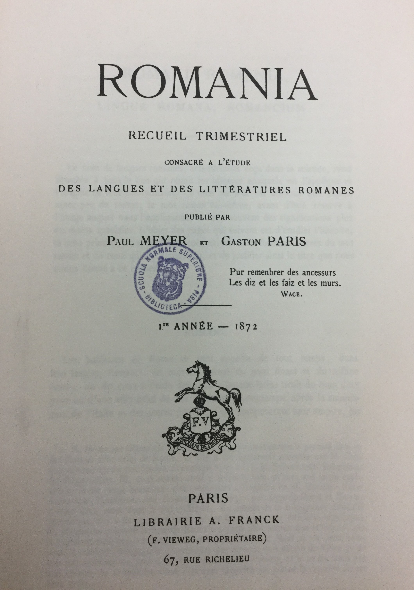
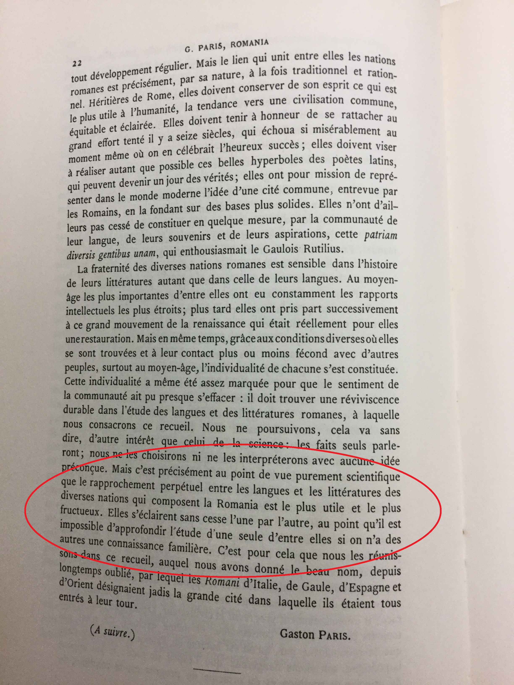

# Romania

- *Romania: recueil trimestriel consacré à l'étude des langues et des littératures romanes* 
- 1872 ad oggi
- fondata da Paul Meyer e Gaston Paris
- epigrafe: *Pour remenbrer des ancessurs / Les diz et les faiz et les murs*, Wace
- disponibili su Gallica, la biblioteca digitale della BnF, i numeri fino agli anni '50 circa.

Introduzione al primo volume

# Meyer

- 1840-1917
- École des chartes

Lettera di Paul Meyer a Alessandro d'Ancona. Da: Ciociola, Claudio, a cura di. *La nuova filologia: precursori e protagonisti*. Pisa: Ets, 2015.

